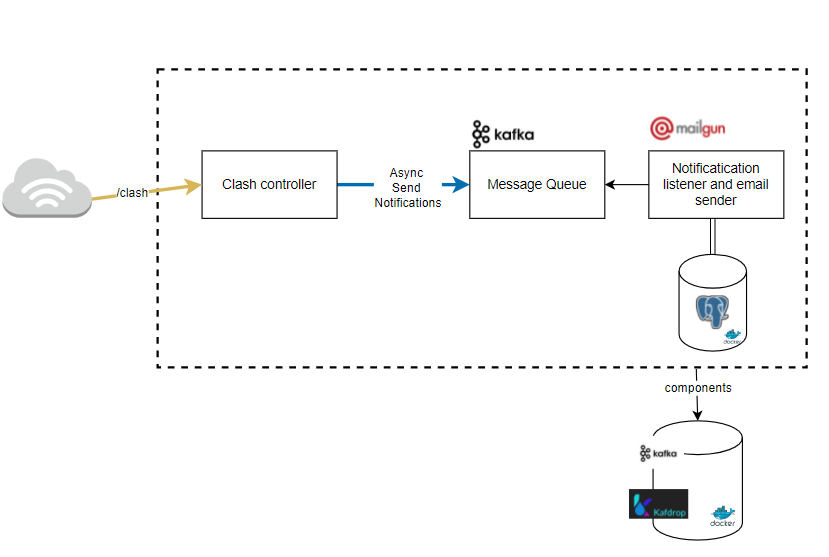

### project example
+ this is a basic project to practice kafka as a message broker. we make a simple request with openfeign to Clash Of Clans api and then we send a message 
to a queue, so one listener can save the message and send it via Mailgun api.



## run project
+ run  the following command to start containers
```
docker compose up -d
```
+ dont forget to change your env variables in both ymls
+ run main application.

## wip...
